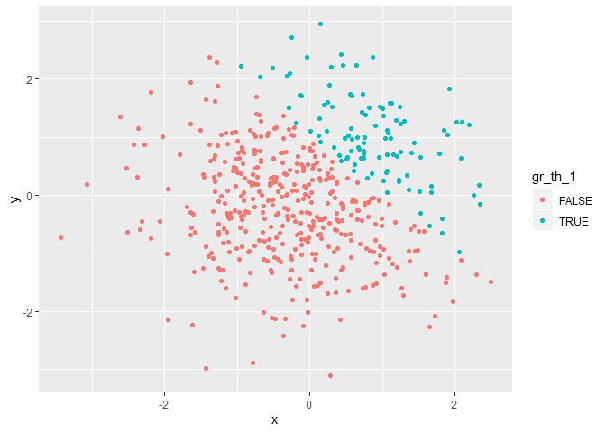
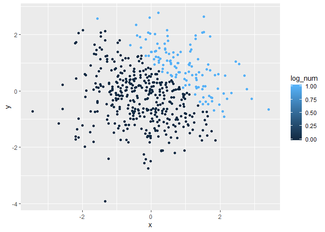
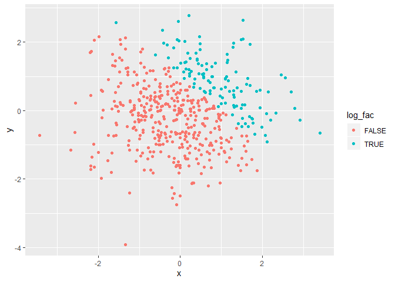

Homework 1
================
Julia Thompson
9/20/2019

## Problem 1

Below is code to create a simple data frame containing a random sample
of size 8 from a standard normal distribution, a logical vector
indicating whether elements of the sample are greater than 0, a
character vector of length 8, and a factor vector of length 8 with 3
different factor levels.

``` r
simple_df1 = tibble(
  sample_norm = rnorm(8),
  gr_th_0 = sample_norm > 0,
  vec_char = c("One", "Two", "Three", "Four", "Five", "Six", "Seven", "Eight"),
  vec_factor = factor(c("male", "male", "other", "female", "male", "male", "female", "other")) 
)
```

If I attempt to take the mean of each variable in the dataframe, I
obtain values for the numeric and logical variables, but see an error
and end up with NA for the character and factor variables. This is what
we would expect, since you cannot perform mathematical operations on
words.

``` r
mean(pull(simple_df1, sample_norm))
```

    ## [1] 0.08953345

``` r
mean(pull(simple_df1, gr_th_0))
```

    ## [1] 0.375

``` r
mean(pull(simple_df1, vec_char))
```

    ## [1] NA

``` r
mean(pull(simple_df1, vec_factor))
```

    ## [1] NA

The below code chunk applies the *as.numeric* function to the logical,
character, and factor variables. We see that both logical and factor
variables can be converted to numeric, though the mean of a logical
variable could be taken without conversion as seen above. Character
variables are unable to be converted to numeric this way. This shows
that, even though I have typed numbers in my character variable, R does
not understand the meaning and cannot evaluate them. When we use the
*as.numeric* function on the factor variable, each element assumes the
value of it’s level’s index.

``` r
as.numeric(pull(simple_df1, gr_th_0))
as.numeric(pull(simple_df1, vec_char)) #this does not work
as.numeric(pull(simple_df1, vec_factor))
```

The below code chunk tests three different scenarios:

1.  Convert the logical vector to numeric, and multiply the random
    sample by the result

2.  Convert the logical vector to a factor, and multiply the random
    sample by the result

3.  Convert the logical vector to a factor and then convert the result
    to numeric, and multiply the random sample by the result

The second scenario does not work because factor variables are
categorical, so multiplicaiton cannot be performed. We see a key
difference in logical versus numeric versus facor variables. Logical to
numeric converts *true* to 1 and *false* to 0. However, logical to
factor converts *true* to 2 and *false* to 1 because of the way factors
index the components (alphabetically).

``` r
log_to_num = as.numeric(pull(simple_df1, gr_th_0))
rs_x_log_to_num = log_to_num * pull(simple_df1, sample_norm)

log_to_fac = as.factor(pull(simple_df1, gr_th_0))
rs_x_log_to_fac = log_to_fac * pull(simple_df1, sample_norm) # Factor variables are categorical, so this won't work

log_to_fac_to_num = as.numeric(log_to_fac)
rs_x_log_to_fac_to_num = log_to_fac_to_num * pull(simple_df1, sample_norm)

log_to_num
```

    ## [1] 1 0 0 0 1 0 1 0

``` r
log_to_fac
```

    ## [1] TRUE  FALSE FALSE FALSE TRUE  FALSE TRUE  FALSE
    ## Levels: FALSE TRUE

``` r
log_to_fac_to_num
```

    ## [1] 2 1 1 1 2 1 2 1

``` r
rs_x_log_to_num
```

    ## [1] 0.4154770 0.0000000 0.0000000 0.0000000 2.2018925 0.0000000 0.3985496
    ## [8] 0.0000000

``` r
rs_x_log_to_fac_to_num
```

    ## [1]  0.8309540 -0.1292094 -0.7552855 -0.1642445  4.4037851 -0.2735022
    ## [7]  0.7970992 -0.9774100

``` r
rs_x_log_to_fac
```

    ## [1] NA NA NA NA NA NA NA NA

## Problem 2

``` r
simple_df2 = tibble(
  x = rnorm(500),
  y = rnorm(500),
  gr_th_1 = x + y > 1,
  log_num = as.numeric(gr_th_1),
  log_fac = as.factor(gr_th_1)
)
```

The above dataframe contains 5 variables *(x, y, gr\_th\_1, log\_num,
log\_fac)* of 500 observations each. X and y are both normally
distributed variables. X has a mean of -0.0865988, median of -0.1156611,
and standard deviation of 1.0008718. The variable *gr\_th\_1* represents
whether x + y is greater than 1. There are 105/500 (0.21) cases where
x+y is greater than 1.

Below are three scatterplots of y vs x. On the first, points are colored
using the logical variable. The second and third scatterplots color
points using the numeric and factor variables, respectively. Both the
logical and factor color scales are binary (producing 2 solid colors).
However, use of the numeric variable for coloring produces a gradient
that ranges over the values (0 to 1), but only 2 colors are displayed in
the scatterplot because we only have 2 values
represented.

``` r
colored_logical = ggplot(simple_df2, aes(x = x, y = y, color=gr_th_1)) + geom_point()
colored_numeric = ggplot(simple_df2, aes(x = x, y = y, color=log_num)) + geom_point()
colored_factor = ggplot(simple_df2, aes(x = x, y = y, color=log_fac)) + geom_point()

colored_logical
```

<!-- -->

``` r
colored_numeric
```

<!-- -->

``` r
colored_factor
```

<!-- -->

``` r
ggsave("colored_logical.pdf")
```

    ## Saving 7 x 5 in image
